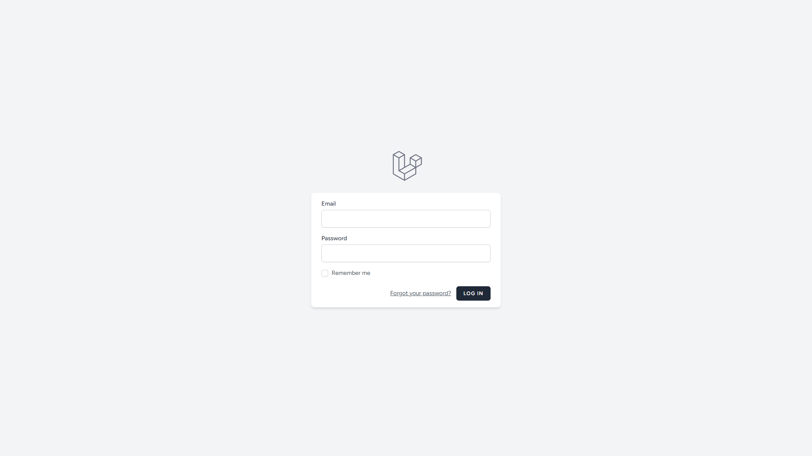
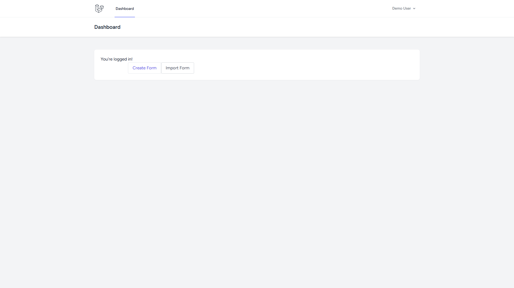
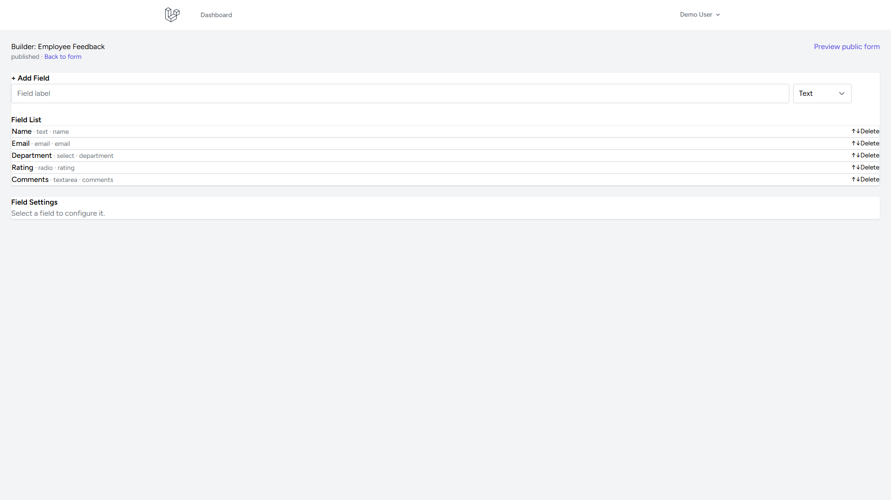
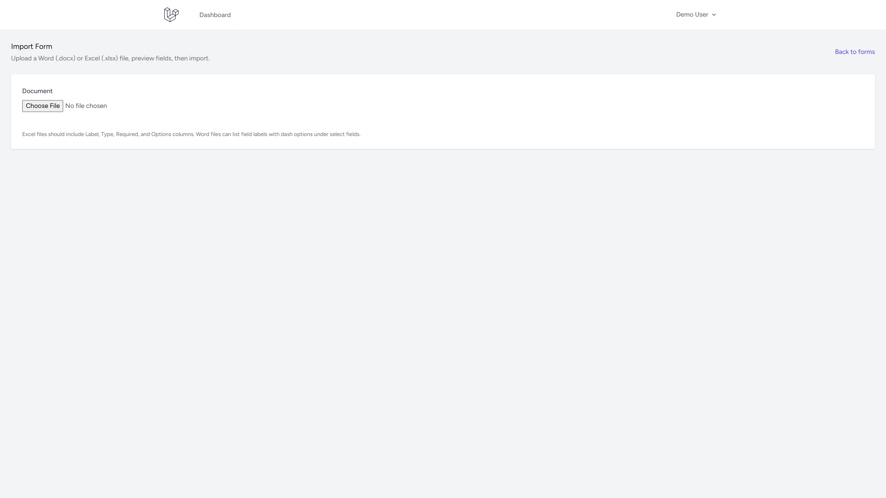
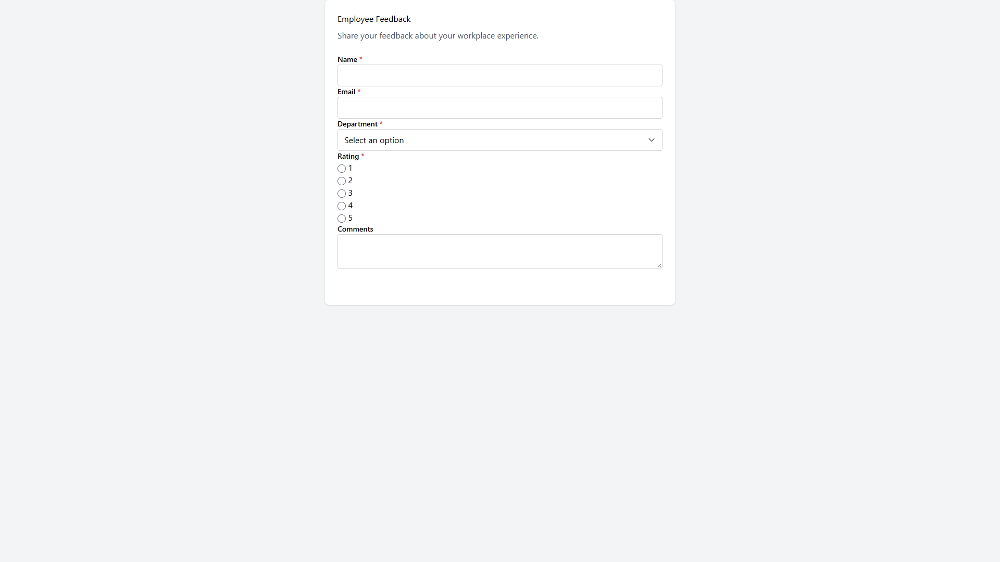
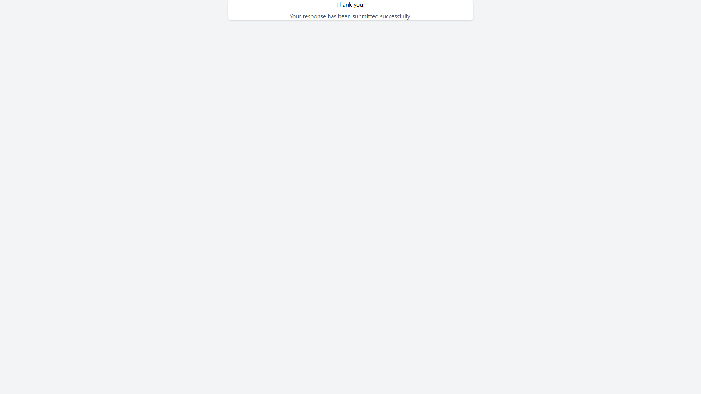

# AI Form Builder

Build, publish, and collect responses with dynamic forms — create them manually, generate them with AI, or import from Word and Excel.

**Live demo:** _Add your public HTTPS URL after deployment_  
**Repository:** _Add your GitHub URL after publishing_

## Demo credentials

| Field | Value |
|-------|--------|
| Email | `demo@example.com` |
| Password | `password` |

After `php artisan migrate:fresh --seed`, sign in with the credentials above to explore sample forms and submissions. Visiting `/` redirects to the login page.

---

## Project overview

AI Form Builder is a Laravel application that lets authenticated users:

- Design forms with a Livewire builder
- Generate drafts from natural-language prompts (OpenAI via Laravel HTTP Client)
- Import form definitions from `.docx` and `.xlsx` files
- Publish public forms and collect validated submissions
- Manage everything through a Sanctum-protected REST API

Manual creation, AI generation, and document import all share the same persistence pipeline (`FormService` + `FormBuilderService`) so validation and storage stay consistent.

## Feature highlights

| Area | What you get |
|------|----------------|
| Builder | Drag-friendly field list, types, validation, reorder |
| AI | Prompt → structured form + fields, logged attempts |
| Import | Word/Excel upload, preview, then builder |
| Public | Shareable `/f/{uuid}` + success page |
| API | Versioned `/api/v1` with Sanctum + Postman collection |

## Features

- Dynamic field types (text, email, select, radio, checkbox, file, and more)
- Livewire dashboard, builder, and public form renderer
- AI form generation with provider abstraction and generation logs
- Word (`.docx`) and Excel (`.xlsx`) import with preview UI
- REST API (`/api/v1`) with standardized JSON envelopes
- Public form URLs and submission success flow
- Policies, Sanctum tokens, rate limits on generate/import
- Seeded demo account, sample forms, and submissions
- Login-first landing (no default Laravel welcome page)

## Architecture overview

```
Browser / Postman
       │
       ▼
 Livewire UI  ·  REST /api/v1  ·  Public /f/{uuid}
       │
       ▼
 Controllers / Livewire  →  Policies  →  Services
       │
       ├── FormService / FormBuilderService / SubmissionService
       ├── AIService → AIProviderInterface (OpenAI)
       └── ImportService → Word / Excel parsers
       │
       ▼
 MySQL/SQLite  ·  storage/  ·  ai_generation_logs / import_logs
```

See [`docs/architecture.md`](docs/architecture.md) for Mermaid diagrams (request lifecycle, AI, import, submissions).

## Technology stack

- PHP 8.2+, Laravel 12
- Livewire 3 + Laravel Breeze (auth)
- Laravel Sanctum (API tokens)
- MySQL / SQLite
- PhpWord + PhpSpreadsheet (imports)
- OpenAI Chat Completions via Laravel HTTP Client (no OpenAI SDK)
- Vite + Tailwind CSS

## Requirements

- PHP 8.2+ with extensions: `mbstring`, `openssl`, `pdo`, `tokenizer`, `xml`, `ctype`, `json`, `bcmath`, `fileinfo`, `zip` (recommended: `gd` for PhpSpreadsheet images)
- Composer 2
- Node.js 18+ and npm
- MySQL 8+ (or SQLite for local/demo)
- Optional: OpenAI API key for AI generation

## Installation

```bash
git clone <repository-url> ai-form-builder
cd ai-form-builder
composer install
cp .env.example .env
php artisan key:generate
npm install && npm run build
```

Configure `.env` (database and optional `OPENAI_API_KEY`), then:

```bash
php artisan migrate --seed
php artisan storage:link
php artisan serve
```

Visit `http://127.0.0.1:8000` — you are redirected to **Login**. Sign in with the demo credentials.

## Environment setup

| Variable | Purpose | Default |
|----------|---------|---------|
| `APP_NAME` | Browser title & branding | `AI Form Builder` |
| `APP_URL` | Public application URL | `http://localhost:8000` |
| `DB_*` | Database connection | MySQL `ai_form_builder` |
| `AI_PROVIDER` | Active AI provider key | `openai` |
| `OPENAI_API_KEY` | OpenAI secret (never commit) | — |
| `OPENAI_BASE_URL` | OpenAI API base URL | `https://api.openai.com/v1` |
| `OPENAI_MODEL` | Chat model | `gpt-4o-mini` |
| `AI_TEMPERATURE` | Sampling temperature | `0.2` |
| `AI_MAX_TOKENS` | Max completion tokens | `2000` |
| `AI_TIMEOUT` | HTTP timeout (seconds) | `30` |
| `AI_RETRIES` | Retry attempts | `2` |
| `AI_RETRY_DELAY` | Retry delay (ms) | `1000` |
| `FORMS_IMPORT_MAX_FILE_SIZE_KB` | Max import upload size | `5120` |
| `FORMS_MAXIMUM_FIELDS` | Max fields per form | `100` |
| `FORMS_UPLOAD_MAX_FILE_SIZE_KB` | Submission file uploads | `10240` |

## Database setup

```bash
php artisan migrate
php artisan migrate:fresh --seed   # reset + demo data
```

Seed data includes the demo user, published sample forms, fields, and example submissions.

## Running the application

```bash
# PHP only
php artisan serve

# Full local stack (server, queue, logs, Vite)
composer run dev
```

Public forms are available at `/f/{uuid}` after publishing.

## Running tests

```bash
php artisan test
# or
composer test
```

AI and document parsers are mocked or use generated fixtures — tests never call the real OpenAI API.

## AI configuration

1. Set `OPENAI_API_KEY` in `.env`.
2. Adjust model/timeout/retries under `config/ai.php` (env-driven).
3. Call `POST /api/v1/forms/generate` with `{ "prompt": "..." }` or extend the UI later.
4. Every attempt is logged to `ai_generation_logs` (`success` / `failed`).

Providers are bound through `AIProviderInterface`. Adding Gemini/Claude/Azure requires a new provider class + `config/ai.php` entry.

## Import configuration

- Allowed extensions: `.docx`, `.xlsx` (`config/forms.php` → `import.allowed_extensions`)
- Max size: `FORMS_IMPORT_MAX_FILE_SIZE_KB`
- UI: **Import Form** → upload → preview → import → builder
- API: `POST /api/v1/forms/import` (multipart `file`)
- Sample files: [`docs/sample-files/`](docs/sample-files/)

## API authentication

1. Register/login via the web app (or create a user in seeders/tinker).
2. Create a Sanctum token:

```php
$user = App\Models\User::where('email', 'demo@example.com')->first();
$token = $user->createToken('postman')->plainTextToken;
```

3. Send `Authorization: Bearer {token}` on private `/api/v1/*` routes.

See [`docs/api.md`](docs/api.md) and the Postman collection at [`docs/postman/`](docs/postman/).

## Folder structure

```
app/
  Enums/ Policies/ Exceptions/
  Http/Controllers/Api/  Http/Requests/  Http/Resources/
  Livewire/              # Dashboard, builder, public forms, import UI
  Services/
    AI/                  # AIService, PromptBuilder, ResponseParser, Providers
    Form/                # FormService, FormBuilderService, SubmissionService
    Import/              # ImportService, Word/Excel importers, ImportParser
bootstrap/ config/ database/
docs/
  api.md  architecture.md  DEPLOYMENT.md
  postman/  sample-files/  screenshots/
public/                  # index.php, favicon, built assets
resources/views/         # Blade layouts + Livewire
routes/  storage/  tests/
```

Architecture notes: [`docs/architecture.md`](docs/architecture.md)  
Decisions: [`DECISIONS.md`](DECISIONS.md)  
Deployment: [`docs/DEPLOYMENT.md`](docs/DEPLOYMENT.md)

## Screenshots

| Screen | Image |
|--------|--------|
| Login |  |
| Dashboard |  |
| Form Builder |  |
| Import Form |  |
| Public Form |  |
| Submission Success |  |

AI generation is available via `POST /api/v1/forms/generate` (see Postman). Capture an API/Postman screenshot as `docs/screenshots/04-ai-generation.png` when demonstrating with a live `OPENAI_API_KEY`. Import **preview** after uploading a sample file can be captured as `docs/screenshots/05-import-preview.png`.

## Deployment

Recommended hosts: Laravel Cloud, Render, Railway, DigitalOcean App Platform, or a VPS.

Checklist:

1. Set `APP_ENV=production`, `APP_DEBUG=false`, strong `APP_KEY`, and HTTPS `APP_URL`.
2. Provision MySQL (or managed Postgres if you adapt the connection).
3. Set `OPENAI_API_KEY` and other secrets in the host’s environment — never commit `.env`.
4. Build assets: `npm ci && npm run build`.
5. Run `php artisan migrate --force`, `php artisan storage:link`, `php artisan optimize`.
6. Ensure the web root is `public/`, and `storage/` + `bootstrap/cache/` are writable.
7. Configure a queue worker if you enable queued jobs later.
8. Confirm file uploads and import size limits match host limits (`client_max_body_size` / PHP `upload_max_filesize`).

Full guide: [`docs/DEPLOYMENT.md`](docs/DEPLOYMENT.md). After deploy, update this README with the **Live demo** URL and publish the GitHub repository.

## Future improvements

- In-dashboard AI prompt UI (API already exists)
- Additional AI providers (Gemini, Claude, Azure OpenAI)
- Async AI/import jobs with progress polling
- Conditional field logic and multi-page forms
- Export submissions to CSV/Excel
- Team workspaces and role-based access
- Webhooks on new submissions

## Documentation index

| Doc | Description |
|-----|-------------|
| [DECISIONS.md](DECISIONS.md) | Architectural decisions |
| [docs/architecture.md](docs/architecture.md) | Flows and structure |
| [docs/api.md](docs/api.md) | REST API reference |
| [docs/DEPLOYMENT.md](docs/DEPLOYMENT.md) | Production checklist |
| [docs/postman/](docs/postman/) | Postman collection |
| [docs/sample-files/](docs/sample-files/) | Sample Word/Excel imports |
| [docs/screenshots/](docs/screenshots/) | UI screenshots |

## License

MIT. Built on the Laravel framework (also MIT).
