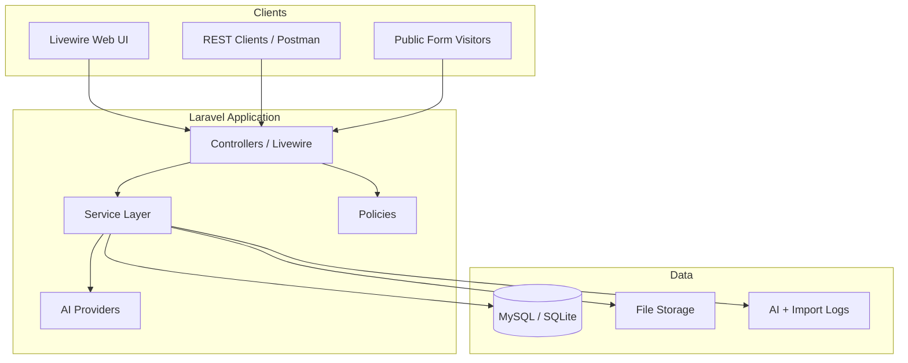
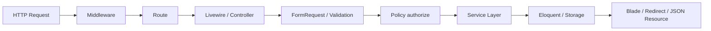
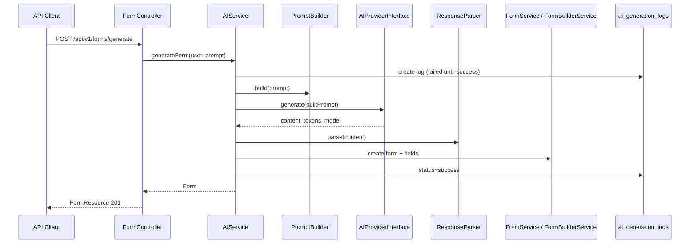
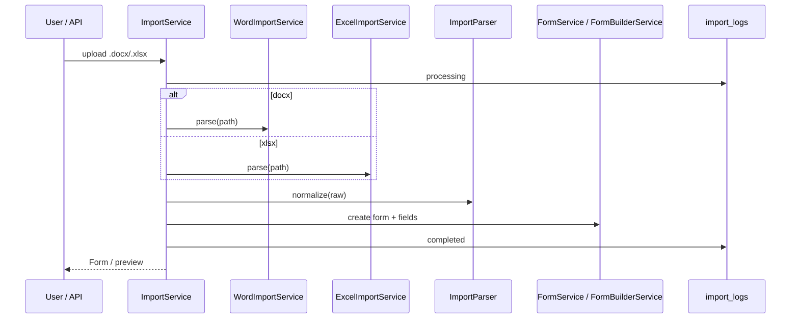
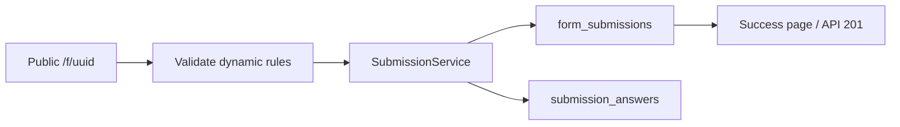

# Architecture Overview

AI Form Builder is a Laravel application with three client surfaces that share one domain layer:

1. **Livewire web UI** — auth, dashboard, form builder, import preview
2. **REST API** (`/api/v1`) — Sanctum tokens for programmatic access
3. **Public forms** — `/f/{uuid}` for respondents (no auth)

Manual creation, AI generation, and document import all converge on `FormService` + `FormBuilderService`.

## High-level architecture



## Request lifecycle



1. Request hits `public/index.php` → Laravel kernel.
2. Middleware: session/CSRF (web), Sanctum (API), throttle where configured.
3. Route resolves Livewire component or API controller.
4. FormRequest / Livewire validation runs.
5. `Gate::authorize()` enforces ownership policies.
6. Service layer performs domain work and persistence.
7. Response: Blade/Livewire HTML, redirect, or JSON `ApiResponse` + Resource.

Unauthenticated visits to `/` redirect to `/login`. Authenticated users hitting guest routes are sent to `/dashboard`.

## AI generation workflow



Key classes: `AIService`, `PromptBuilder`, `ResponseParser`, `OpenAIProvider` (`AIProviderInterface`).

## Import workflow



UI path: **Upload → Preview** (`ImportService::preview`) → **Confirm** (`importNormalized`) → **Builder**.

## Submission workflow



Only **published** forms accept public submissions. Owners list/inspect/delete via authenticated API/UI.

## Folder organization

```
app/
  Enums/                 FieldType, FormStatus, ImportStatus
  Exceptions/AI|Import/  Domain exceptions → API messages
  Http/
    Controllers/Api/     Thin REST controllers
    Requests/            Web + Api FormRequests
    Resources/           API transformers
  Livewire/              Forms, Builder, Public, Import
  Policies/              FormPolicy
  Services/
    AI/                  Generation orchestration
    Form/                CRUD, builder, submissions
    Import/              Document import pipeline
  Traits/ Support/       ApiResponse helpers
config/
  ai.php                 Provider settings
  forms.php              Field types, pagination, import limits
database/migrations|seeders|factories
docs/                    architecture, api, deployment, postman, samples, screenshots
resources/views/         Blade + Livewire layouts
routes/web.php|api.php|auth.php
tests/Feature|Unit
```

## Controllers & services

API controllers validate, authorize, delegate to services, and return Resources. They do not contain persistence logic.

Reusable operations (publish, duplicate field, generate, import) live in services so Livewire and API stay aligned.

## Query scopes

List filtering uses model scopes (`status`, `search`, `sort`, `ownedBy`) instead of fat controllers.

## Resources & errors

API Resources control visibility. `BaseApiRequest` and exception renderers in `bootstrap/app.php` emit consistent JSON for 401/403/404/422 and AI/Import domain errors.

## Related

- [DECISIONS.md](../DECISIONS.md) — architectural decisions
- [api.md](api.md) — REST reference
- [DEPLOYMENT.md](DEPLOYMENT.md) — production checklist
